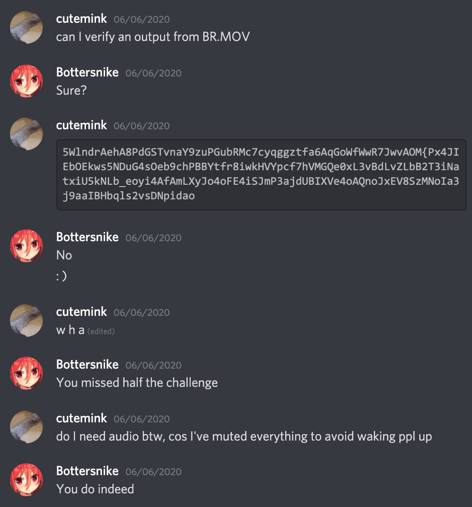

# BR.MOV

### Writeup by Ana, 400 points

`https://youtu.be/zi3pLOaUUXs`

In this challenge, we're provided with a YouTube video in which some dude would say some numbers whilst a barcode was displayed on the screen. 

I watched the video for the first time in the middle of the night, and had to mute my laptop, hence meaning I didn't hear the numbers first time around. I played the video at 0.25x speed so that it didn't move between barcodes quite so fast, and noted down each string that appeared when I scanned each barcode. 

Concatenating them and throwing them into CyberChef under the Magic tool did essentially nothing, so I decided to ask the challenge admin whether the output of my concatenation was correct:

_Great._ It was time to pack up and retry the challenge the next day. 

Upon another check, I realised that each string had a different number in reference to it. I decided to note it all down on paper, with each string and its corresponding number in a neat table. Here's what I got:

| Number | Barcode Result |
| :----: | :------------: |
|   5    |   5WlndrAehA   |
|   8    |   8PdGSTvnaY   |
|   9    |   9zuPGubRMc   |
|   7    |   7cyqggztfa   |
|   6    |   6AqGoWfWwR   |
|   7    |   7JwvAOM{Px   |
|   4    |   4JIEbOEkws   |
|   5    |   5NDuG4sOeb   |
|   9    |   9chPBBYtfr   |
|   8    |   8iwkHVYpcf   |
|   7    |   7hVMGQe0xL   |
|   3    |   3vBdLvZLbB   |
|   2    |   2T3iNatxiU   |
|   5    |   5kNLb_eoyi   |
|   4    |   4AfAmLXyJo   |
|   4    |   4oFE4iSJmP   |
|   3    |   3ajdUBIXVe   |
|   4    |   4oAQnoJxEV   |
|   8    |   8SzMNoIa3j   |
|   9    |   9aaIBHbqls   |
|   2    |   2vsDNpidao   |
|   1    |   1}gfkrtfrm   |

A few interesting observations I made were that the 6th and last barcodes each had a { and } respectively within them. Considering we know that the flag format is ractf{}, seeing r, a, c, t and f in the 1st, 2nd, 3rd, 4th and 5th strings looked even more promising. Looking at the first string, I noticed that r is the 6th character in the string, meaning that if we ignored the number at the start of the string, the 5th character after that is where the flag begins!

Sure enough, a was the 9th character in the second string, c the 10th, t the 8th and so on. Completing this process and concatenating the characters given from every string leaves us with the flag!

## Flag: ractf{b4rc0d3_m4dn3ss}