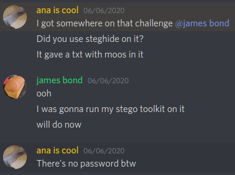
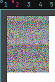
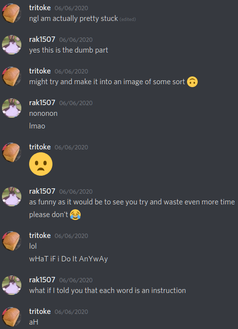

# Mad CTF Disease

### Writeup by tritoke, 350 points

`Todo: `
`[x] Be a cow `
`[x] Eat grass `
`[x] Eat grass `
`[x] Eat grass `
`[ ] Find the flag`

So when we first take a look at the image provided, it just seems like an image of a cow chilling in a field.
I first took a look at the metadata in the image with ``exiftool``:

```
$ exiftool cow.jpg

ExifTool Version Number         : 11.85
File Name                       : cow.jpg
Directory                       : .
File Size                       : 118 kB
File Modification Date/Time     : 2020:06:06 13:23:08+01:00
File Access Date/Time           : 2020:06:07 17:24:21+01:00
File Inode Change Date/Time     : 2020:06:06 13:25:13+01:00
File Permissions                : rw-r--r--
File Type                       : JPEG
File Type Extension             : jpg
MIME Type                       : image/jpeg
JFIF Version                    : 1.01
Resolution Unit                 : None
X Resolution                    : 1
Y Resolution                    : 1
Image Width                     : 838
Image Height                    : 559
Encoding Process                : Baseline DCT, Huffman coding
Bits Per Sample                 : 8
Color Components                : 3
Y Cb Cr Sub Sampling            : YCbCr4:2:0 (2 2)
Image Size                      : 838x559
Megapixels                      : 0.468
```

- - -

This tells us a lot of metadata about the file, sometimes people hide flags / hints there so it's always good to check.
Next I tried ``binwalk``:

```
$ binwalk -Me cow.jpg

DECIMAL       HEXADECIMAL     DESCRIPTION
-----------------------------------------------------------------
0             0x0             JPEG image data, JFIF standard 1.01
```

However this also turned up nothing.
I was talking with my teammate and she said she had been working on the challenge before, and that ``steghide`` had brought up some results for her:



So now that I know ``steghide`` gives some results lets run ``steghide``:
```
$ steghide extract -sf cow.jpg

Enter passphrase:
wrote extracted data to "moo.txt".
```

We now have the embedded file: ``moo.txt`` so lets take a look:
```
$ head -3 moo.txt

OOOMoOMoOMoOMoOMoOMoOMoOMoOMMMmoOMMMMMMmoOMMMMOOMOomOoMoOmoOmoomOo
MMMmoOMMMMMMmoOMMMMOOMOomOoMoOmoOmoomOoMMMmoOMMMMMMmoOMMMMOOMOomOo
MoOmoOmooOOOmoOOOOmOomOoMMMmoOMMMMOOMOomoOMoOmOomoomOomOoMMMmoOmoO
```

Its quite large so I've only shown the top three lines here.
I tried a bunch of different strategies to try and get some meaning out of this text.
From interpreting each character as a base 2 literal and trying all possible combinations of that:
```python
#!/usr/bin/env python
import itertools as it

def transform_block(tab, block):
    table = dict(zip(tab, range(4)))
    return sum(
        table[b] << ((3-i) * 2)
        for i,b in enumerate(block)
    )

with open("moo.txt") as f:
    data = "".join(f.read().splitlines())

for tab in it.permutations("omOM"):
    for i in range(0, len(data), 4):
        transform_block(tab, data[i:i+4])
```

To turning the raw ASCII values into an RGB image using gimp...



So at a bit of dead-end I asked the challenge author for a hint:



So with some mad skills (pasting some ciphertext into Google) you can find this:
``https://esolangs.org/wiki/COW``

This page then links to an interpreter for the esolang:
``http://www.frank-buss.de/cow.html``

Then pasting in the contents of ``moo.txt`` gets us the flag:
```
ractf{exp3rt-mo0neuv3r5}
```
