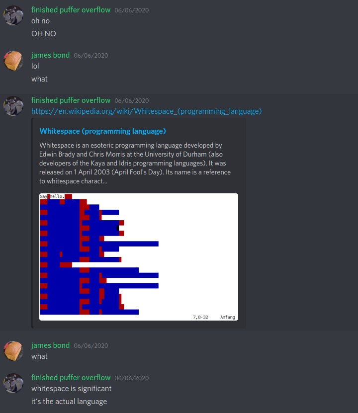

# Reading Between the Lines

### Writeup by tritoke, 300 points

`We found a strange file knocking around, but I've got no idea who wrote it because the indentation's an absolute mess!`

For this challenge we are given a bit of a weird C program which has some very funky indentation and whitespace.

Having looked at it for a while my teammate suggested it might be the whitespace language:



So I found the original interpreter for this language from the web archives.
``https://web.archive.org/web/20150623025348/http://compsoc.dur.ac.uk/whitespace/``

And then:
```
$ ./wspace main.c

ractf{R34d1ngBetw33nChar4ct3r5}
Fail: Unrecognised input
```

