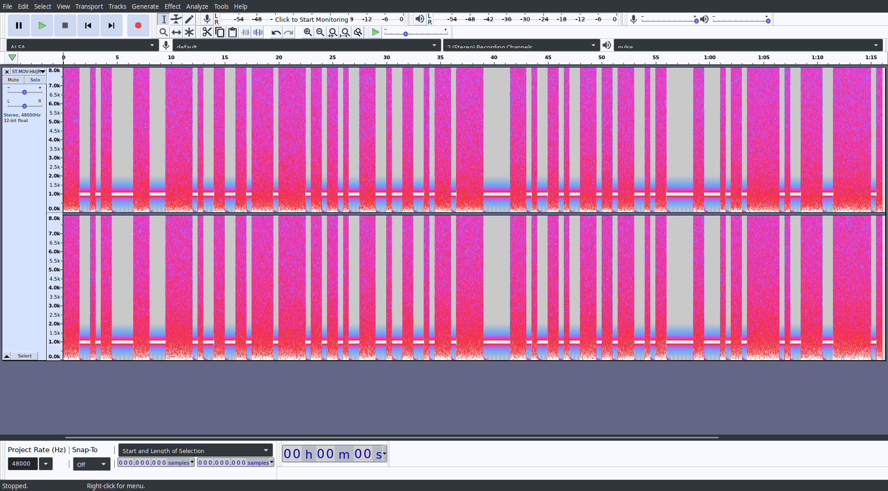

# ST.MOV

### Writeup by tritoke, 250 points

`https://youtu.be/HkIJRzzHP5E`

To start with this challenge we get a link to a YouTube video:


It just alternates between static and black, playing a constant tone when black.
Lets download the audio so we can take a look locally:
```
$ youtube-dl -x 'https://www.youtube.com/watch?v=HkIJRzzHP5E&feature=youtu.be'

[youtube] HkIJRzzHP5E: Downloading webpage
[youtube] HkIJRzzHP5E: Downloading MPD manifest
[dashsegments] Total fragments: 9
[download] Destination: ST.MOV-HkIJRzzHP5E.webm
[ffmpeg] Destination: ST.MOV-HkIJRzzHP5E.opus
Deleting original file ST.MOV-HkIJRzzHP5E.webm (pass -k to keep)
```

We can now open up the audio in ``audacity`` and take a look:



This view is using audacity to turn the audio into a spectrogram.
This is very useful when you want to look at patterns in the data,
or in our case, see a stark difference between a tone and noise.


Taking a closer look at when the audio changes from noise to a tone, it is clear to see that each change occurs on either a second of half second boundary.

If we take the audio and treat each half second of noise as a one and the tone as a zero.
We can extract a binary string from the noise.
It was a teammate who originally had this idea:


And they sent me the resulting binary to work with (I've switched the 1s and 0s from the original code):
```
1110010110000111000111110100110011011110111110110110100111001
0011001011101111100000111010011010011101101110010110000011000
101101111110100111100111111101
```

If we now take this binary and decode it as 7 bit ASCII we get part of the flag:
```python
#!/usr/bin/env python
import itertools as it
import pydub

# recipe from itertools wiki page
def grouper(iterable, n, fillvalue=None):
    "Collect data into fixed-length chunks or blocks"
    # grouper('ABCDEFG', 3, 'x') --> ABC DEF Gxx"
    args = [iter(iterable)] * n
    return it.zip_longest(*args, fillvalue=fillvalue)

def decode(l):
    return "".join(
        chr(int("".join(i), 2))
        for i in l
    )

with open("binary") as f:
    binary = f.read().strip()

print(decode(grouper(binary, 7, "0")))
```
outputs this:
```
ractf{videoAiS[K
                ?'Ot
```
so we know we're on the right track.
Adding a zero in after the o in video gives us even more of the flag:
```
ractf{video timeAE_Sgz
```
Repeating again after the e in time and we have the flag:
```
ractf{video time bois}
```

Full script:
```python
#!/usr/bin/env python
import itertools as it
import pydub

# recipe from itertools wiki page
def grouper(iterable, n, fillvalue=None):
    "Collect data into fixed-length chunks or blocks"
    # grouper('ABCDEFG', 3, 'x') --> ABC DEF Gxx"
    args = [iter(iterable)] * n
    return it.zip_longest(*args, fillvalue=fillvalue)

def decode(l):
    return "".join(
        chr(int("".join(i), 2))
        for i in l
    )

with open("binary") as f:
    binary = f.read().strip()

print(decode(grouper(binary, 7, "0")))

binary1 = binary[:77] + "0" + binary[77:]
print(decode(grouper(binary1, 7, "0")))

binary2 = binary[:77] + "0" + binary[77:111] + "0" + binary[111:]
print(decode(grouper(binary2, 7, "0")))
```
