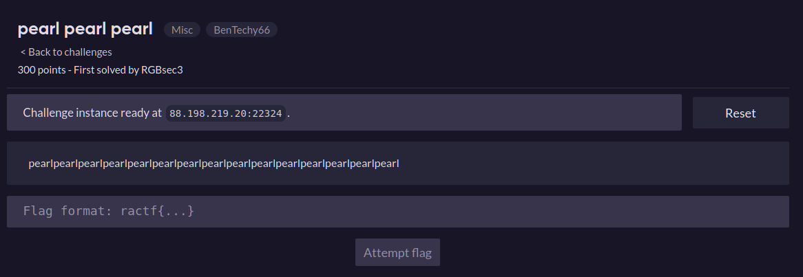
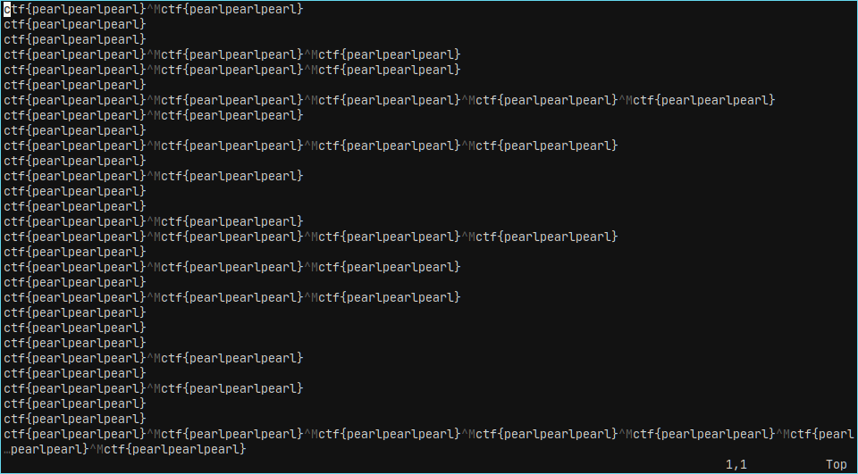

# pearlpearlpearl
### Writeup by tritoke, 300 points

`pearlpearlpearlpearlpearlpearlpearlpearlpearlpearlpearlpearlpearlpearlpearl`

At the start of the challenge, we are given practically no information at all, just an IP address and port number.



So lets use ``netcat`` to connect to the port and see what happens:
```
nc 88.198.219.20 22324 | vim -
```


Vim is useful here because it doesn't display ``\r`` as a newline like in other programs such as ``less`` / ``more``.
This allows us to see straight off the bat that something is a bit iffy with the mix of newlines and carriage returns.
Let's remove all of the ``ctf{pearlpearlpearl}`` strings and use ``xxd`` to see whats up with the newlines.

```
$ nc 88.198.219.20 22324 | sed 's/ctf{[pearl]*}//g' | xxd

00000000: 0d0a 0a0a 0d0d 0a0d 0d0a 0a0d 0d0d 0d0a  ................
00000010: 0d0a 0a0d 0d0d 0a0a 0d0a 0a0a 0d0a 0d0d  ................
00000020: 0d0a 0a0d 0d0a 0a0d 0d0a 0a0a 0a0d 0a0a  ................
00000030: 0d0a 0a0a 0d0d 0d0d 0d0d 0a0a 0d0d 0a0a  ................
00000040: 0d0d 0a0a 0d0a 0d0d 0d0a 0a0a 0d0d 0a0d  ................
00000050: 0d0d 0a0a 0d0d 0d0a 0d0a 0d0a 0a0a 0a0a  ................
00000060: 0d0d 0a0a 0d0d 0d0a 0d0a 0a0d 0a0a 0a0d  ................
00000070: 0d0a 0a0a 0d0d 0a0a 0d0d 0a0a 0d0d 0d0a  ................
00000080: 0d0a 0a0d 0d0a 0d0d 0d0d 0a0a 0d0d 0a0a  ................
00000090: 0d0a 0d0a 0a0a 0a0a 0d0d 0a0a 0d0a 0d0d  ................
000000a0: 0d0a 0d0a 0a0a 0a0a 0d0a 0a0d 0d0d 0a0a  ................
000000b0: 0d0a 0a0d 0a0a 0d0d 0d0d 0a0a 0d0a 0d0d  ................
000000c0: 0d0a 0a0d 0a0a 0d0a 0d0a 0a0a 0a0a 0d0a  ................
```

From this we can see there is a nice even number of CR / LF characters and they are not in the same order every line.
Given that the number of characters is a clean multiple of 8 I want to try encoding them as either a 1 or 0.
Then decoding that as the binary representation of an ASCII character.
```python
#!/usr/bin/env python

with open("just_newlines", "rb") as f:
    data = f.read()

encoded = (
    data.replace(b"\r", b"0")
        .replace(b"\n", b"1")
)

for i in range(0, len(data), 8):
    print(chr(int(encoded[i:i+8], 2)),end="")
print()
```

The above script performs those actions and reveals the flag:
```
ractf{p34r1_1ns1d3_4_cl4m}
```
