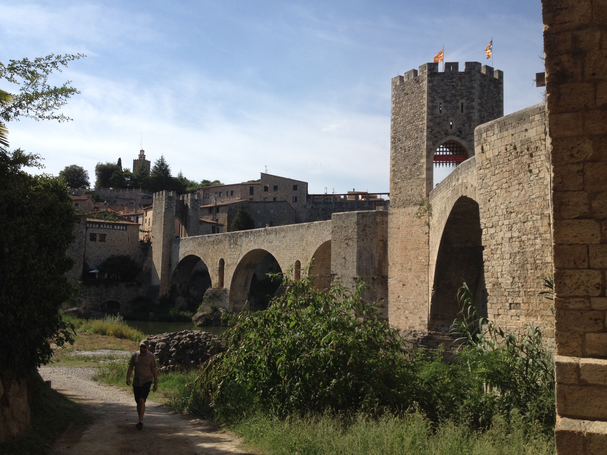

# Brick by Brick

### Writeup by Segway, 400 points

`Wow! You're killing these! One of our social media monitoring team just sent us an urgent message. I've reproduced it below for you. `
`> FROM: mmmmmmmmmmmmm@mmmmmm.org `
`> TO: mmmmmmmmmmmmmmmmm@mmmmmm.org `
`> > Sorry about the Instagram account fiasco. `
`> > `
`> > It looks like the target still hasn't learnt radio `
`> > silence, and has just created a Twitter account, with `
`> > the same handle! It doesn't look especially active, `
`> > but we managed to find a photo of where he was `
`> > yesterday. `
`> > `
`> > Can you work out what town this photo was taken in? `
`> > `
`> > One of the other guys on the team thinks if we know `
`> > where he was we should be able to track him down faster. `
`> END `
`As usual, we've set up the map. It should be accurate to 2km.`

The image has two flags. One of them is the [Estelada](https://en.wikipedia.org/wiki/Estelada), a flag flown by Catalan nationalists, and the other one is the flag of Catalonia. This means that the location is narrowed to the Spanish region of Catalonia. Catalonia has 4 main provinces, each with their respective capital cities: Barcelona (the capital of the region), Girona, Lleida and Tarragona.

However, this is irrelevant, as a reverse image search using Google identifies the structure as the Romanesque Bridge of [Besalú](https://en.wikipedia.org/wiki/Besal%C3%BA).

**NOTE:** This challenge's flag is submitted after selection on a map and is hence not explicit.