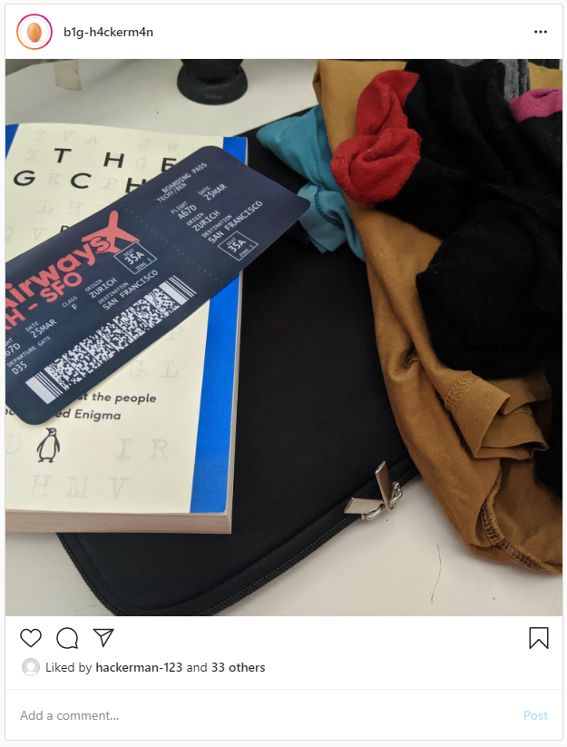

# RAirways

### Writeup by Segway, 200 points

`Agent. We found a target posting strange images of boarding passes to his Instagram. None of the guys at base can figure it out, but we think he's been using the images to exfiltrate data. We've attached a high-quality version of the image below, here's the one from his Instagram:`



The image contains a boarding pass, with a barcode. Boarding passes use the PDF417 standard, so a PDF417 scanner such as [Binary Eye](https://github.com/markusfisch/BinaryEye) can scan the barcode:

```
M1TECHY/BEN           EDED833FZRHSFORA A67D 069F035A0007 100
ractf{B0ard1ngP4ssD4t4}
```

The flag is `ractf{B0ard1ngP4ssD4t4}`.

