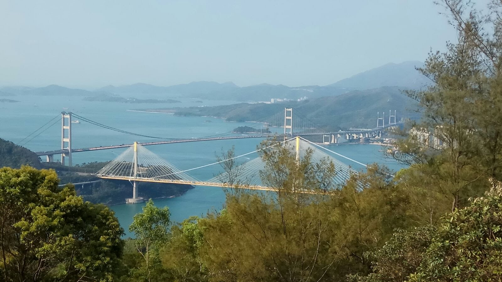

# Suspended Belief

### Writeup by Segway, 350 points

`Amazing work with that last image! We dispatched a team right away, but it seems our target was one step ahead of us. We're not sure what they're planning, but we managed to download one final image off the Instagram account until they locked it down. `

`Can you work out where this picture was taken? One of the guys thought it might have been Queensferry crossing, but that doesn't look right. You'll have to be accurate to within 2 kilometres.`

The image is a picture of two bridges near each other, with a third bridge connected to the left bridge,  and a set of small islands can be seen in the distance. The challenge description mentions the Queensferry Crossing, which is a cable-stayed bridge, much like the right bridge in the picture. The left bridge is a suspension bridge.

Looking at Wikipedia's [list of longest suspension bridges](https://en.wikipedia.org/wiki/List_of_longest_suspension_bridge_spans) for suspension bridges with two bars on the suspenders, and two main suspenders, we find the [Tsing Ma Bridge](https://en.wikipedia.org/wiki/Tsing_Ma_Bridge), which is a suspension bridge that matches the appearance of the left bridge. Near the Tsing Ma Bridge, we find the [Ting Kau Bridge](https://en.wikipedia.org/wiki/Ting_Kau_Bridge), which matches the appearance of the right bridge, and the [Kap Shui Mun Bridge](https://en.wikipedia.org/wiki/Kap_Shui_Mun_Bridge), which matches the appearance of the bridge in the background.

We can then identify the location the photo was taken from as near [Yau Kom Tau](https://en.wikipedia.org/wiki/Yau_Kom_Tau).

**NOTE:** This challenge's flag is submitted after selection on a map and is hence not explicit.