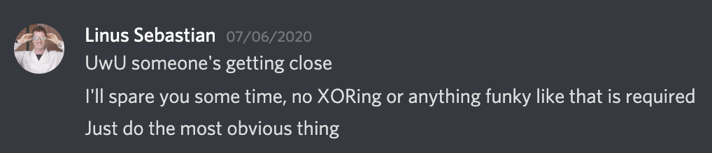
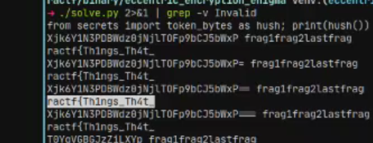

# Eccentric Encryption Enigma

### Writeup by all of PWN to 0xE4, 850 points

`Agent,`

`We've got a tough assignment for you.`

`We recovered a mysterious binary from a computer which we were asked to investigate in a criminal case.`

`The suspect in question is to be held on trial for various computer-related crimes, we've managed to make sense of everything else so far, except this binary. We think it might contain important information which could provide incriminating evidence, but we're not fully sure.`

`Nonetheless, can you take a look and see what it holds?`

**NOTE:** This challenge was by far the hardest in the whole CTF and took 5 team members screaming at it in a voice chat at once to figure out. Enjoy reading through the fruits of our labour. 

Opening, we are presented with output by the program that we need to install memecrypt to use it, hinting it will be used it somewhere. 

## Getting a Clue

On run, the program spits out random nonsensical data. In order to figure out what is going on, we can determine what parts of memecrypt.py it is using by modifying the source as we have control of this.

Using time.sleep() or any other relevant indicator we can see what part of memecrypt is being used and when. It appears the program does not even encrypt anything, instead decrypting the string:
	"eDxTP2RoekN4KkVXeDpQQyU+Sy5cPidXZSR6QGRaLktkSycrITpQS1xXem5cV3pvZTpFb2NXekRcNkstZSRub2U6RW9qJGZH"

Unbase64'd and against the keymapping (the key used to decrypt this string was 'lmao' as derived by printing out self.enc_key), this decodes as:

	from secrets import token_bytes as hush; print(hush())

This returns the exact string of data we see given in the output of the program, modifying secrets.py to return something different reflects this.

Memecrypt is returning this back to the program, which executes it. In this case we now effectively have some program execution control.

## Fake Flag

From enumerating various functions and variables that are accessible, of all different functions the 'flag()' function is most notable.

Running this function causes data to be passed to the memecrypt function, in forms of a set message and a key.

Modifying memecrypt.py to leak this, we end up with an encrypted message of:

	"K3swTVxHOGtyWVclZmd0OGYueUZ5RzJYXForP1wwdHJbR1dhVGcrPytndFFUPzhMW0dcdA=="

With a key of:

	1337_revese_engineering

With this in mind, this is decrypted using the following python code:

	memecrypt.meme_cipher("K3swTVxHOGtyWVclZmd0OGYueUZ5RzJYXForP1wwdHJbR1dhVGcrPytndFFUPzhMW0dcdA==", "1337_revese_engineering").decrypt()

Which then decodes to:

	ractf{Sik3_Y0u_Th0ug4t_T4is_W4s_A_Fl4g}

;-;

As it seems progressing any further through this route is going to be difficult, instead opting for a more static analysis approach and attempting to find strings within the Cython program, due to the way it's compiled allowing us to do this, may be a better method. As we now know we are looking for strings to decrypt, this should be _slightly_ less guessy.

## Making Sense of the Mess

After crashing literally every team member's computer, crying to the Challenge Author (who was wholly sympathetic, knowing the monster he created) and finding several more dead leads, we decided to take a more passive approach and see what could be found within each function.

Running `disas` within `gdb` on `__pyx_`  gave us a nice list of some functions with... _interesting_ names. Further disassembling these led to dead ends, rick rolls, Monstercat releases, but also some actually relevant B64 strings. 

3 of these functions (with names that we refuse to mention) included 2 variables each - one with a B64 string and the other with a random English word to go with it. Trying Memecrypt on them at first led to unreadable strings in 2 of them, with one decoding to "lastfrag" - we figured out we needed to pad the strings with =s at the end to make them valid B64. Using Memecrypt on these allowed us to decrypt them eventually:

|  Base64 String   |    Key    | Decoded  |
| :--------------: | :-------: | :------: |
|   QVZHZUEqOnM=   |   rain    |  frag1   |
|   ZGBXYmRbfXU=   | champions |  frag2   |
| T0YqVGBGJzZiLXYp |  apollo   | lastfrag |

**NOTE:** We took ages to figure this out. At first we tried bruteforcing permutations of combinations of the words and the strings with Memecrypt until we realised they corresponded to the same ones in the same functions. 

## Linking to Another Discovery

Looking further through the binary earlier, we had discovered more B64 strings in variables in disassembled functions, except these didn't have corresponding words attached to them (yes, we also bruteforced these). But now, we were beginning to realise that the decoded fragments could be part of the key used to decode these other strings further, and with a nudge from the challenge author, we were convinced this was how we'd get the flag. 

We then tried to bruteforce all the other strings with all the concatenations of the fragments using Memecrypt, and one came out partially successful against the concatenated key of frag1frag2lastfrag:

Almost there! Knowing that this half formed the first half of the ciphertext, and that the key had to be this form of the key, we stopped bruteforcing and tried each half individually against this one. A rival team was also catching up to us and the race was on - who would solve EEE first?

But alas - none of the other strings seemed to work, even when trying padding. Hope seemed lost for a few minutes and the chatter in the voice chat died down to a monotone. 

Then came a development - one of our team members decided to look at the raw bytes of some of the variables and discovered we were missing several characters from <u>all</u> of our strings (at the challenge's conclusion we decided to check whether this was the case with the earlier key strings, and turns out we missed =s which meant we didn't even need to bruteforce padding as well).

We quickly typed these in and got ready to bruteforce concatenations with our new strings, as the voice chat rose to a crescendo - and we got it! We beat our rival team, solved our final challenge in the CTF, and finally claimed our spot in 2nd place. 

## Flag: ractf{Th1ngs_Th4t_I_Cann0t_Compr3hend}