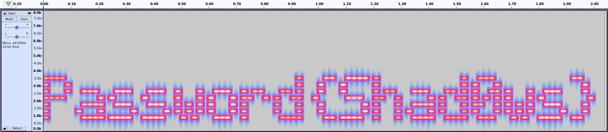

# A Monster Issue

### Writeup by tritoke, 100 Points

`Agent,`

`We've got a case of industrial espionage, quite an unusual one at that. An international building contractor - Hamilton-Lowe, has written to us that they are having their private client contracts leaked.`

`After conducting initial incident response, they managed to find a hidden directory on one of their public facing web-servers. However, the strange thing is, instead of having any sensitive documents, it was full of mp3 music files.`

`This is a serious affair as Hamilton-Lowe constructs facilities for high-profile clients such as the military, which means having building schematics leaked from them could lead to a lapse in national security.`

`We have attached one of these mp3 files, can you examine it and see if there is any hidden information inside?`

To start with this challenge we are give a ``mp3`` file: ``aero_chord.mp3``
Listening to the track nothing particularly seems to be off about it.
This lead me to running ``binwalk`` on the binary:

```
$ binwalk -Me aero_chord.mp3


Scan Time:     2020-06-08 20:55:58
Target File:   /home/tritoke/cyber/ctfs/2020/ractf/forensics/a_monster_issue/aero_chord.mp3
MD5 Checksum:  b782e5f1c75a7c574f3b03f949fedca2
Signatures:    391

DECIMAL       HEXADECIMAL     DESCRIPTION
--------------------------------------------------------------------------------
1726          0x6BE           JPEG image data, JFIF standard 1.01
5162942       0x4EC7BE        Zip archive data, at least v2.0 to extract, uncompressed size: 191624, name: OwO.wav
5252619       0x50260B        End of Zip archive, footer length: 22


Scan Time:     2020-06-08 20:55:59
Target File:   /home/tritoke/cyber/ctfs/2020/ractf/forensics/a_monster_issue/_aero_chord.mp3.extracted/OwO.wav
MD5 Checksum:  04dcaaa610087fa50ecb35d990b0fe4f
Signatures:    391

DECIMAL       HEXADECIMAL     DESCRIPTION
--------------------------------------------------------------------------------
179972        0x2BF04         Zip archive data, encrypted compressed size: 11480, uncompressed size: 11854, name: flag.png
191602        0x2EC72         End of Zip archive, footer length: 22


Scan Time:     2020-06-08 20:56:00
Target File:   /home/tritoke/cyber/ctfs/2020/ractf/forensics/a_monster_issue/_aero_chord.mp3.extracted/_OwO.wav.extracted/flag.png
MD5 Checksum:  d41d8cd98f00b204e9800998ecf8427e
Signatures:    391

DECIMAL       HEXADECIMAL     DESCRIPTION
--------------------------------------------------------------------------------
```

This reveals two new files, ``OwO.wav`` and ``2BF04.zip``.
``2BF04.zip`` has a password so we can't open it yet, but we can look at ``OwO.wav``.
Listening to it and it sounds very odd, kind of like lots of beeps?
So I opened it up in audacity, and looked at the spectrogram:



This reveals the password ``Shad0ws``.
We can now use this password to open ``2BF04`` and get the flag:

```
7z e 2BF04.zip
```

## Flag: ractf{M0nst3rcat_In5tin3t}

