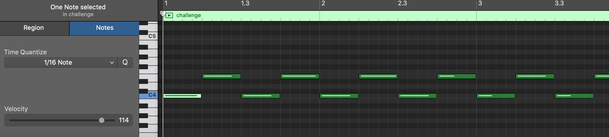
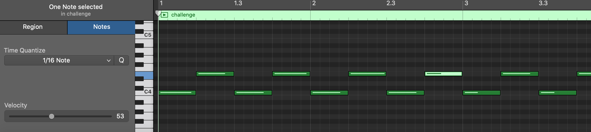

# A Musical Mix-up

### Writeup by Ana, 200 Points

`One of our guys found a strange midi file lying around on our servers. We think there might be some hidden data in it. See if you can help us out!`

There are two different methods one could take in order to approach this challenge after figuring out what is going on.

## Method 1

Unfortunately for the challenge creator, I love music creation and hence had all my tools set up to open and check a MIDI. I sat down at my desk, opened GarageBand and got to work checking out the file. (**A/N:** You can in fact use any program that is able to play a MIDI file to figure out what is off with the notes. A free example is MuseScore.)

Upon first listen I immediately determined that the note velocities (how hard a key would be pressed if it were to be played in real life - lower velocities often mean a discernably softer sound and higher velocities mean a harsh, loud press) were all over the place. 





Different notes clearly had wildly differing velocities in some areas of the tune, but what is immediately noticeable is that each velocity is within the decimal range of being able to correspond to discernible ASCII characters. I noted each velocity down sequentially from looking at them in GarageBand, and chucked them into a Decimal to ASCII decoder - and voila! We have our flag repeated across the notes in the entire song.

```
ractf{f50c13ty_l3vel_5t3g!}
```

**NOTE:** [This link](https://electronicmusic.fandom.com/wiki/Velocity) is very useful for learning more about exactly what note velocity is. If you're interested in music production I recommend it!

## Method 2

This challenge did in fact interest me even after solving it, so I wanted to see what another approach would be like, as this definitely wasn't limited to people who have DAWs and musical experience. 

After a bit of research, I came across [this Twilio blog post](https://www.twilio.com/blog/working-with-midi-data-in-python-using-mido) which detailed exactly how to parse note velocities from a MIDI file using the Python library `mido`. I then made the following script which outputted the flag as well!

```python
import mido

flag = ""

midiiii = mido.MidiFile('challenge.mid')
for track in midiiii.tracks:
    for item in track:
        if item.type == "note_on":
            if item.velocity > 0:
                flag += chr(item.velocity)

print(flag)
```

```
ractf{f50c13ty_l3vel_5t3g!}ractf{f50c13ty_l3vel_5t3g!}ractf{f50c13ty_l3vel_5t3g!}ractf{f50c13ty_l3vel_5t3g!}ractf{f50c13ty_l3vel_5t3g!}ractf{f50c13ty_l3vel_5t3g!}ractf{f50c13ty_l3vel_5t3g!}ractf{f50c13ty_l3vel_5t3g!}ractf{f50c13ty_l3vel_5t3g!}ractf{f50c13ty_l3vel_5t3g!}ractf{f50c13ty_l3vel_5t3g!}ractf{f50c13ty_l3vel_5t3g!}ractf{f50c13ty_l3vel_5t3g!}ractf{f50c13ty_l3vel_5t3g!}ractf{f50c13ty_l3vel_5t3g!}ractf{f50c13ty_l3vel_5t3g!}ractf{f50c13ty_l3vel_5t3g!}ra
>>> 
```