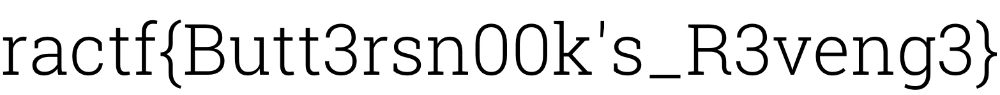

# Access Granted

### Writeup by Ana, 450 Points

`Agent, `
`Do you recall the C2 group exfiltrating data we were tracking last year? Well, as it turns out, we've managed to corroborate their activities with APT-47 nicknamed 'The Engineers'. Their operations span across a wide range of industries, including disrupting SCADA systems and stealing corporate data. `

 `Recently, they've been leaking unreleased tracks from various media groups. A Canadian firm, which suffered a fresh leak, has requested us to take a look. Over the past few days, our analysts have combed through network data trying to identify which computers or servers may have been compromised and used. `

`In order to bypass detection from IDS/DLP signatures, we think they're somehow extracting these tracks by hiding them in existing music videos so it blends in with usual traffic. We've attached a video that we believe is going to one of their IP addresses, can you take a look?`

This challenge provides an attached file of `Grant_Color.mp4,` which is 46.83 MB in size. At first, I wasn't sure where exactly to begin on this challenge, so the first step was poking the file using different steg and forensics tools to see what results we could achieve from it. 

After trying Binwalk and Steghide (on an audio converted version of the file with no password) I eventually got a result from using Foremost on the file, which gave us a PNG which stated the following:

```
password{guitarmass}
```

Immediately, we know that we're looking to apply some other technique to the video file which involves the use of a password. We can rule out steghide from trying that earlier, so I decided to look for more obscure techniques which I could apply to the video. One that stood out to me in my mind (from earlier research I did in the year for my EPQ on Digital Forensics) was embedding a TrueCrypt volume within an MP4 - and since the circumstances matched, and there was the need for a password, I decided to attempt it.

**A/N:** You can find more information on this technique here: https://lifehacker.com/embed-a-truecrypt-volume-in-a-playable-video-file-5771142

Following the guide above, I booted up VeraCrypt (you could also use another TrueCrypt mounting program, VeraCrypt however is open-source and free) and mounted the MP4 as a volume, initially using `password{guitarmass}` and then just `guitarmass` as a password, of which the latter worked! 

Checking inside the volume, we can see a PNG file, which is simply the flag. 



