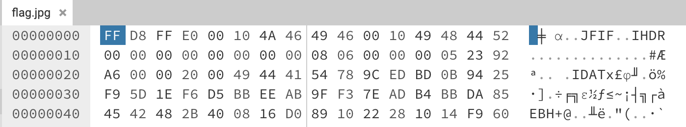

# Cheap Facades

### Writeup by Ana, 400 Points

`We've found a JPEG, but it doesn't seem to open in any of our editors. Can you see what's going on?`

Ah, the final broken image challenge. But hold on a second, it seems this one's a JPEG? 

Hex editors often don't lie, and the first thing you can see when opening up this "JPEG" in one is that it possesses PNG chunks such as IHDR and IDAT. So it's clearly a PNG masquerading as a JPEG, explaining the challenge name of Cheap Facades.

After a quick edit of the JPEG header, removing any untoward bytes and replacing it with the PNG signature, we immediately see that this image has the exact same issue as seen in Dimensionless Loading (see our writeup of that for a full Python script). 

After running our script to fix the missing length and height specifications, we can open our output PNG and we have the flag!

