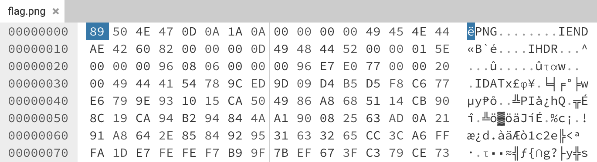

# Cut Short

### Writeup by Ana, 200 Points

`This image refuses to open in anything, which is a bit odd. Open it for the flag!`

The classic broken PNG challenge makes its first appearance (in this CTF) here - but we first need to figure out what exactly is wrong with it.

Considering this challenge is worth only 200 points, I decided to skip any preliminary measures for the time-being and jump straight into a hex editor, where I could start examining the chunks to see what is off. 

Instantly we can see that the IEND chunk is in the completely wrong place. However, scrolling to the end of the file, we can see a second IEND chunk that is placed correctly. This simply means we should delete the 4 null bytes following the PNG signature and the 8 bytes signifying the IEND chunk, leaving the start of the IHDR chunk in its place. 

Having done this, we can then download the edited hex and open the file as a normal PNG, giving us the flag. 

