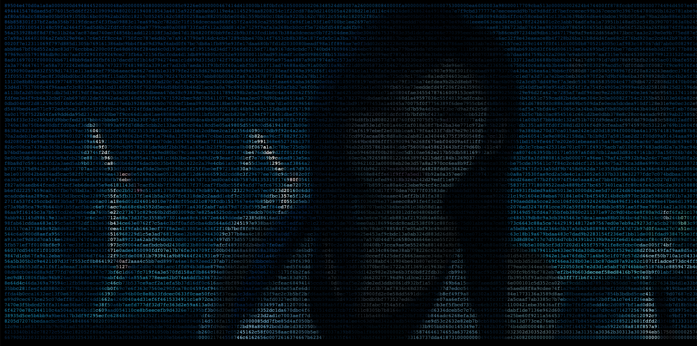

# Disk Forensics Fun

### Writeup by tritoke, 350 Points

`Agent,`

`Get your forensics gloves out.`

`We've managed to exploit a network service running on a C2 server used for orchestrating a large botnet. From there we were able to escalate our privileges and use that server as a proxy to pivot to other machines in the network.`

`It's quite fascinating, based on the machines we have found, we think that these guys are a known bad actor, responsible for leaking private documents and data from corporate and government targets, which changes our current focus from a reconnaissance mission to a criminal investigation which involves gathering evidence on them so we can attribute names to actions for further prosecution in the courts.`

`Thus, we've started to image the disks of all the machines we have managed to pivot on. It's not the most ideal circumstances for admissibility of evidence, but we do have a warrant on the guys involved and we can let our lawyers do the rest.`

`Anyway, I've attached a disk image of a small Linux server which we believe they're using for temporarily keeping exfiltrated files.`

`Can you take a look and see what you find?`

`Good luck.`

To start of with this challenge we are given an E01 encase image - ``image.E01``
Personally I've had trouble getting autopsy working on my machine so I currently just use ``ewf-tools`` to get the actual contents out.

```
mkdir mnt
ewfmount image.E01 mnt
cp mnt/ewf1 .
umount mnt
```

We now have to get the files out of the image.
The file command tells us that this is an ISO CD-ROM filesystem so we can use the mount command to access the filesystem stored in the file:
```
mount ewf1 mnt
```
If we now go into the home directory on the mounted drive we can see few files:
```
$ ls mnt/home

nothingh.asc
track2.m4a
track.m4a
```
The ``.asc`` file is a message encrypted by PGP and the other two are music videos from Monstercat.
There doesn't really seem to be anything of interest on the rest of the filesystem so lets look for hidden files!

We can use ``binwalk`` to extract all of the files it finds by file signature, this works even with deleted files!
```
binwalk -Me ewf1
```
This now gives us an extracted directory:
```
ractf/forensics/disk_forensics_fun
$ ls _ewf1.extracted
0.iso  iso-root

ractf/forensics/disk_forensics_fun
$ ls _ewf1.extracted/iso-root
BIN  DEV  ETC  HOME  LIB  MEDIA  MNT  OPT  PROC  ROOT  RUN  SBIN
SRV  SYS  TMP  USR  VAR

ractf/forensics/disk_forensics_fun
$ ls _ewf1.extracted/iso-root/ROOT
PRIVATE.PGP  PUBLIC.PGP
```
And some PGP KEYS!

To decrypt the encrypted file we first need to import the keys to our keyring:
```
gpg -import PRIVATE.PGP
gpg -import PUBLIC.PGP
```
We can now decrypt the encrypted file to get, a, webpage???
```
$ gpg --decrypt NOTHINGH.ASC > what.html
```



Copying the hex digits to a file we can then use python to decode from hex:
```python
#!/usr/bin/env python
import binascii

with open("thing") as f:
    hexchars = f.read().strip()

with open("fromhex", "wb") as f:
    f.write(binascii.unhexlify(hexchars))
```

We can now run file on the decoded bytes to see what they are:
```
$ file fromhex

fromhex: PNG image data, 1162 x 86, 8-bit grayscale, non-interlaced
```

We can now view the image to get the flag, or we could read it from the text label metadata property:
```
$ exiftool fromhex | grep ractf

Label                           : ractf{b4s1c_d1sk_f0r3ns1cs}
```


