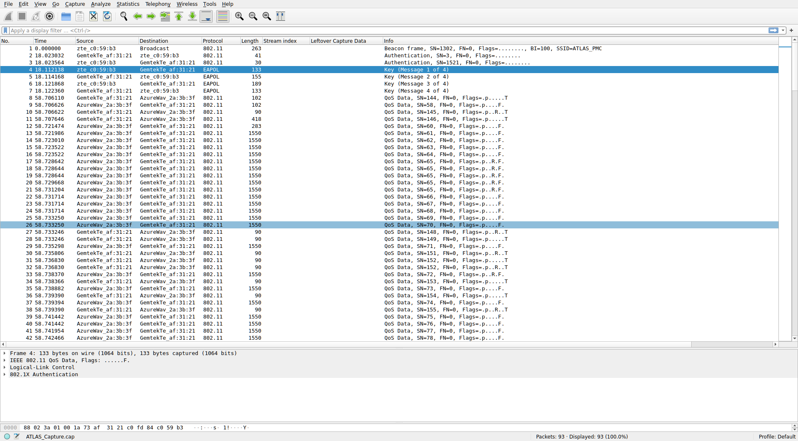
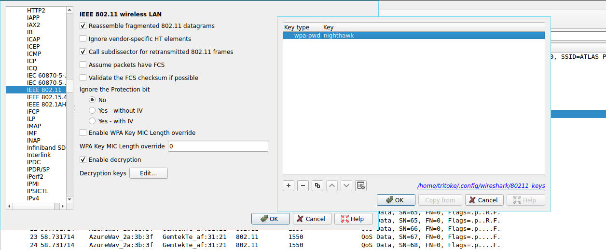
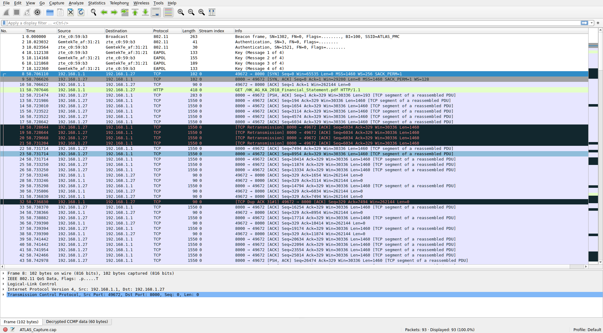

# Peculiar Packet Capture
### Writeup by tritoke, 400 Points

`Agent,`

`We have a situation brewing. Last week there was an attack on the prime minister of Morocco. His motorcade was stopped by a road blockade where heavily armed men opened fire on them. Fortunately, the prime minister was able to escape safely but many personnel and a few other ministers did not.`

`ATLAS, a multi-national Private Military Corporation (PMC) based in Colorado, USA, is our main suspect. We believe they were hired to conduct the hit by the opposition political party.`

`We flew Agent Jason to Colorado to investigate further. He gained access to their building's reception area dressed in a suit acting as a potential client with an appointment. He was able to intercept wireless network traffic from their corporate wireless network before being escorted out by guards when they realised the bluff.`

`The network capture is attached below, see if you can recover any important documents which could help us tie ATLAS to the Morocco incident.`

To start with this challenge we are given a packer capture file: ``ATLAS_Capture.cap``
So I opened it up in wireshark to take a look at the contents.



From this we can see that it is a capture of some wireless communications.
The entire contents of the file are encrypted...
However we have a capture of the handshake used to authenticate to the Access Point (AP).

This means we can use ``aircrack-ng`` to try to recover the key used for encryption:
```
$ aircrack-ng ATLAS_Capture.cap -w /usr/share/dict/rockyou.txt

Reading packets, please wait...
Opening ATLAS_Capture.cap
Read 93 packets.

   #  BSSID              ESSID                     Encryption

   1  C0:FD:84:C0:59:B3  ATLAS_PMC                 WPA (1 handshake)

Choosing first network as target.

Reading packets, please wait...
Opening ATLAS_Capture.cap
Read 93 packets.

1 potential targets


                         Aircrack-ng 1.6

[00:26:13] 10754594/14344391 keys tested (10105.26 k/s)

Time left: --

                     KEY FOUND! [ nighthawk ]


Master Key     : 2B C3 90 3F 5A 04 8E BF 0B 35 06 13 B3 73 E5 32
                 11 C0 A7 F4 99 F3 42 DF D6 8E E0 B7 9E 90 F2 83

Transient Key  : FC D0 AE 93 D5 84 B7 DE 2A A7 F8 40 92 E1 00 CE
                 93 EA 9D A1 FB B1 83 A1 E8 EF C0 FC 9A 77 3A 1A
                 E7 B0 B7 50 B5 B2 72 00 30 BA BB 6F 84 10 84 D4
                 38 75 16 BB 91 11 99 17 B5 EF 6E 98 B4 49 96 FA

EAPOL HMAC     : FA E2 20 1F 32 93 6D AB E8 B4 68 63 0B E6 E3 C6
```

- - -

Now that we have the key used for encryption we can actually just give this key to wireshark to decrypt the traffic.
To add a WPA key we go to ``Edit->Preferences->Protocols->IEEE 802.11`` then there is an option to add decryption keys.



Now the picture of the traffic is very different:



We can see there are some HTTP transmissions in there so lets extract those.
This can be dome with ``File->Export Objects->HTTP`` then save all.

This gives us a PDF and inside it there is the flag:
```
ractf{j4ck_ry4n}
```

