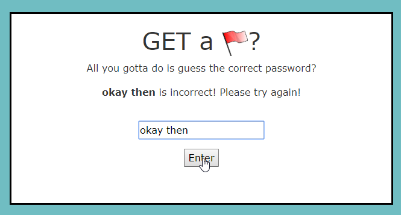
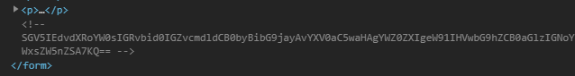
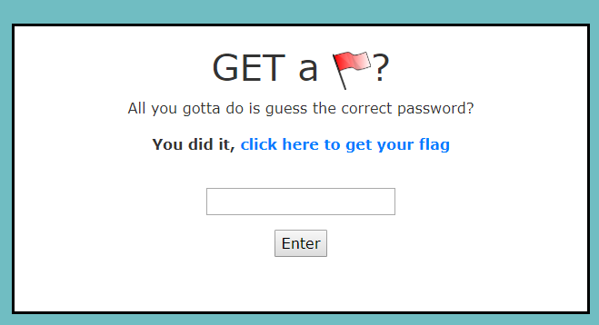

# Web 2: getaflag

Ooh. A form. Let's break it!



Okay, let's see what that did. `http://getaflag.wpictf.xyz:31337/?input=okay+then#`. Cool. Got a nice basic HTTP GET form.

Anything in the page source?



Yes. Got some base64 telling us to go to `/auth.php`. Said PHP file shows us the following:

```php
// Pseudocode
$passcode = '???';
$flag = '????'

extract($_GET);
if (($input is detected)) {
  if ($input === get_contents($passcode)) {
    return $flag
  } else {
    echo "Invalid ... Please try again!"
  }
}
```

I try and avoid PHP, but without having to check docs to see what it did, that `extract($_GET);` looked _really_ sketchy. Upon consulting the docs it got worse. `extract` takes the variables passed to it, and applies them to the local scope. What's in the local scope, why, `passcode`; how convenient.

I tried `/?input=test&passcode=test` but it didn't work. Why? There's a cheaky `get_contents` snuk in there. We're told this is pseudocode, so it's a safe assumption that that's actually `file_get_contents`, which reads a file. What files on the server are we going to be able to predict? `/etc/hostname` is a common one to use for this, but I didn't really feel like guessing the hostname. Oh wait, `/dev/null` exists.

Okay then, let's try `/?input=&passcode=/dev/null` and sure enough it did.. something?



```html
<a href="https://bit.ly/IqT6zt">click here to get your flag</a>
```

Yeah... no. That's Rick Astley.

```html
<script type="text/javascript">
    console.log('Never trust suspicious links');
    console.log('Flag is WPI{1_l0v3_PHP}');
</script>
```

Oh that's nicer. Clearly there's a typo in the flag and it was meant to be `WPI{1_h473_PHP}`, but the typo'd flag worked, so that was fine.

_Side note:_

It turns out that the _actual_ code that was being used had a funny little bug where `/?input=&passcode=` would let you in.
